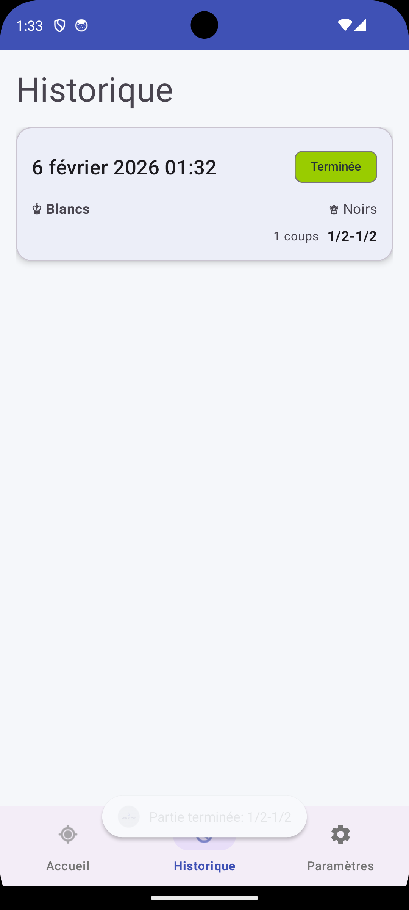
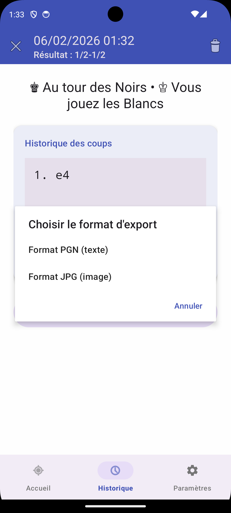
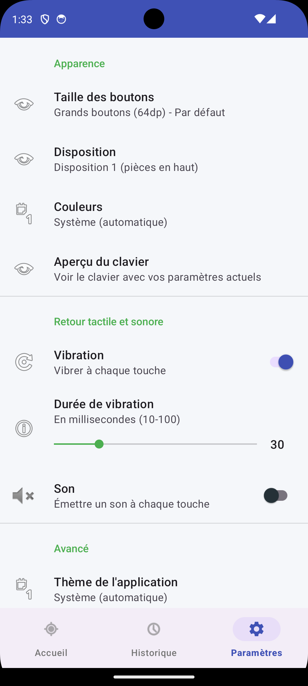

# Coup de Main - Android App ♟️


**Application Android avec clavier IME personnalisé pour la notation d'échecs, adaptée aux joueurs avec difficultés motrices.**

---

## � Aperçu

<p align="center">
  
  
  
  
</p>

---

## �📖 À Propos

**Coup de Main** est né d'un besoin concret : permettre aux joueurs d'échecs ayant des difficultés motrices de noter leurs parties lors de compétitions officielles.

L'application fournit un **clavier tactile simplifié** avec de gros boutons, optimisé pour la notation algébrique standard (SAN), utilisable dans n'importe quelle application Android (Word, Google Docs, etc.).

## ✨ Fonctionnalités

- ✅ **Clavier IME personnalisé** : utilisable dans toutes les apps Android
- ✅ **Gros boutons tactiles** : optimisés pour accessibilité (52dp)
- ✅ **Notation SAN complète** : pièces, cases, roques, promotions, symboles
- ✅ **Preview temps réel** : voir la notation pendant la frappe
- ✅ **Feedback haptique** : vibration au toucher (configurable)
- ✅ **Personnalisation** : taille boutons, thèmes, hauteur clavier
- ✅ **100% hors-ligne** : aucune connexion internet requise
- ✅ **Historique des parties** : sauvegarde et export PGN

## 🚀 Installation

### Pour Utilisateurs

**Depuis les Releases GitHub :**
1. Télécharger le dernier APK depuis [Releases](https://github.com/awcapps/coup-de-main-ime/releases)
2. Installer l'APK sur votre appareil Android
3. Aller dans **Paramètres → Système → Langues et saisie → Clavier virtuel**
4. Activer **"Coup de Main"**
5. Dans une app (Word, Notes), sélectionner le clavier lors de la saisie

### Pour Développeurs

**Prérequis :**
- JDK 17+
- Android SDK (API 21-35)
- Émulateur Android ou device physique

**Build & Run :**
```bash
# Cloner le repo
git clone https://github.com/awcapps/coup-de-main-ime.git
cd coup-de-main-ime

# Build l'app
./gradlew build

# Installer sur émulateur/device
./gradlew installDebug

# Ou directement run
./gradlew run
```

### VS Code

Extensions recommandées :
- Kotlin Language
- Android iOS Emulator
- Gradle for Java

## 📁 Structure

```
coup-de-main/
├── app/
│   ├── src/main/
│   │   ├── java/fr/bkh/coupdemain/
│   │   │   └── MainActivity.kt
│   │   ├── res/
│   │   │   ├── layout/
│   │   │   ├── values/
│   │   │   └── xml/
│   │   └── AndroidManifest.xml
│   ├── build.gradle.kts
│   └── proguard-rules.pro
├── docs/
│   ├── CONTEXTE.md
│   ├── STACK_TECHNIQUE.md
│   └── ROADMAP.md
├── build.gradle.kts
├── settings.gradle.kts
└── CHANGELOG.md
```

## 📚 Documentation

- [CONTEXTE.md](docs/CONTEXTE.md) - Contexte et besoin du projet
- [STACK_TECHNIQUE.md](docs/STACK_TECHNIQUE.md) - Architecture technique
- [ROADMAP.md](docs/ROADMAP.md) - Planning et features
🤝 Contribution

Les contributions sont les bienvenues ! Consultez [CONTRIBUTING.md](CONTRIBUTING.md) pour les guidelines.

**Besoin d'aide pour démarrer ?**
- Regarder les [issues "good first issue"](https://github.com/awcapps/coup-de-main-ime/labels/good%20first%20issue)
- Lire la [documentation technique](docs/STACK_TECHNIQUE.md)
- Consulter la [roadmap](docs/ROADMAP.md)

## 📝 Changelog

Voir [CHANGELOG.md](CHANGELOG.md) pour l'historique complet des modifications.

## 📄 License

Ce projet est sous licence **MIT** - voir [LICENSE](LICENSE) pour plus de détails.

## 🙏 Remerciements

- Créé pour aider les joueurs d'échecs avec des difficultés motrices
- Inspiré par les besoins réels de joueurs en compétition
- Merci à tous les contributeurs et testeurs

## 📧 Contact

- **Issues** : [GitHub Issues](https://github.com/awcapps/coup-de-main-ime/issues)
- **Discussions** : [GitHub Discussions](https://github.com/awcapps/coup-de-main-ime/discussions)
- **Email** : contact@remybaroukh.fr

---

**Développé avec ❤️ pour rendre les échecs plus accessibles** ♟️
- [ ] Test émulateur

**Prochaine étape :** Service IME (Phase 1.2)

## 🛠️ Développement

```bash
# Vérifier le projet
./gradlew check

# Build debug APK
./gradlew assembleDebug

# Build release APK
./gradlew assembleRelease
```

## 📝 Changelog

Voir [CHANGELOG.md](CHANGELOG.md) pour l'historique complet des modifications.

---

**Développé avec ❤️ pour rendre les échecs plus accessibles** ♟️
